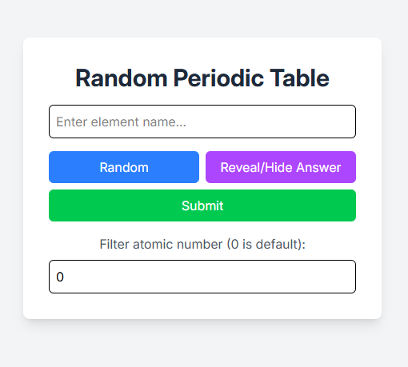
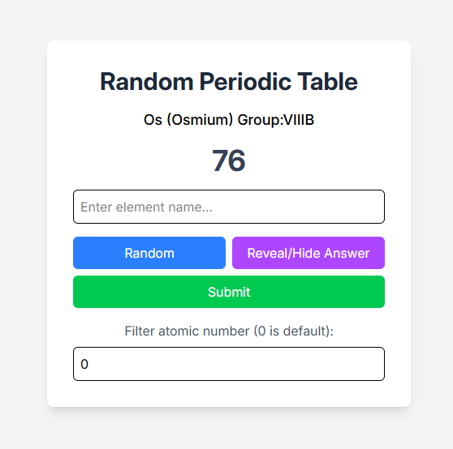

# Random-PeroidicTable-React-Django

Random Perodic Table with React.js and Django using a custom API from my earlier project: [PeriodicTable-RESTAPI-Django](https://github.com/pxiaccount/PeroidicTable-RESTAPI-Django)

## Screenshots
Default


Randomize


## Installation

Clone the repository:
    ```
    git clone https://github.com/pxiaccount/Random-PeroidicTable-React-Django.git
    ```

### Django

1. Change directory in to backend:

    ```bash
    cd  Random-PeroidicTable-React-Django/backend
    ```

2. Create a virtual environment and activate it:
    ```bash
    python -m venv venv
    venv\Scripts\activate  # On Windows
    source venv/bin/activate  # On macOS/Linux
    ```
3. Install the dependencies:
    ```bash
    pip install -r requirements.txt
    ```
4. Create a `.env` file in the root directory of the project and add the following environment variables:
    ````plaintext
    SECRET_KEY=your-secret-key
    ````
    Replace `your-secret-key` with a secure, random string. You can generate a secret key using the following Python code:
    ```python
    from django.core.management.utils import get_random_secret_key
    print(get_random_secret_key())
    ```
5. Apply the migrations:
    ```bash
    python manage.py migrate
    ```
6. Run the development server:
    ```bash
    python manage.py runserver
    ```
### React
1. Change directory in to client:

    ```bash
    cd Random-PeroidicTable-React-Django/client
    ```

2. Install packages:

    ```bash
    npm i
    ```

3. Run the development server:

    ```bash
    npm run dev
    ```
